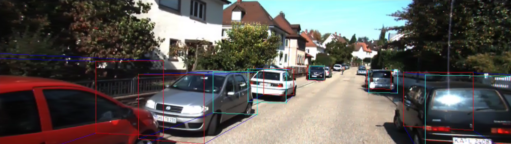
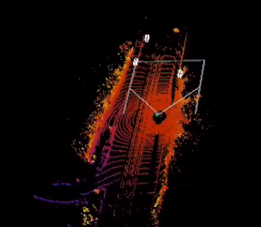
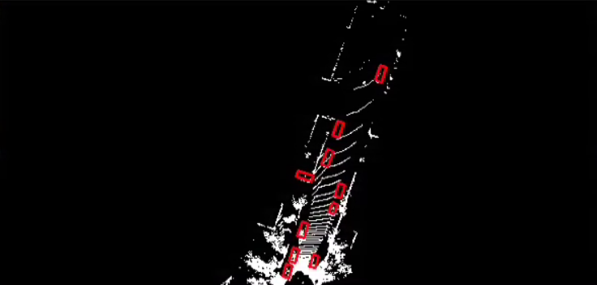

We use `mayavi` for lidar points visualization
```
conda create -n pp3d python=3.7 -y
pip install paddlepaddle-gpu==2.4.1 -i https://mirror.baidu.com/pypi/simple
pip install -r requirements.txt
pip install -e .
pip install vtk==8.1.2
pip install mayavi==4.7.4
pip install PyQt5
```
---
## Single-Frame Visualizaion
### For mono-image
```
cd demo/
python mono_demo_deploy.py \
  --model_file model/smoke.pdmodel \
  --params_file model/smoke.pdiparams \
  --image data/image_2/000008.png
```

### For lidar-points
```
cd demo/
python pcd_demo_deploy.py \
  --model_file model/pointpillars.pdmodel \
  --params_file model/pointpillars.pdiparams \
  --lidar_file data/velodyne/000008.bin \
  --calib_file data/calib/000008.txt \
  --point_cloud_range 0 -39.68 -3 69.12 39.68 1 \
  --voxel_size .16 .16 4 \
  --max_points_in_voxel 32 \
  --max_voxel_num 40000
```

### For bev-view
```
cd demo/
python bev_demo_deploy.py \
  --model_file model/pointpillars.pdmodel \
  --params_file model/pointpillars.pdiparams \
  --lidar_file data/velodyne/000008.bin \
  --calib_file data/calib/000008.txt \
  --point_cloud_range 0 -39.68 -3 69.12 39.68 1 \
  --voxel_size .16 .16 4 \
  --max_points_in_voxel 32 \
  --max_voxel_num 40000
```

## Multi-Frame Visualizaion
### For mono-image
```
python demo/mono_demo.py \
  --config configs/smoke/smoke_dla34_no_dcn_kitti.yml \
  --model demo/smoke.pdparams \
  --batch_size 1
```
### For lidar-points
```
python demo/pcd_demo.py \
  --config configs/pointpillars/pointpillars_xyres16_kitti_car.yml \
  --model demo/pointpillars.pdparams \
  --batch_size 1
```
### For bev-view
```
python demo/bev_demo.py \
  --config configs/pointpillars/pointpillars_xyres16_kitti_car.yml \
  --model demo/pointpillars.pdparams \
  --batch_size 1
```

---
if u encounter the following problems:

`qt.qpa.plugin: Could not load the Qt Platform plugin 'xcb' in ..`

[ref1](https://blog.csdn.net/qq_39938666/article/details/120452028?spm=1001.2101.3001.6650.2&utm_medium=distribute.pc_relevant.none-task-blog-2%7Edefault%7ECTRLIST%7ERate-2-120452028-blog-112303826.pc_relevant_3mothn_strategy_recovery&depth_1-utm_source=distribute.pc_relevant.none-task-blog-2%7Edefault%7ECTRLIST%7ERate-2-120452028-blog-112303826.pc_relevant_3mothn_strategy_recovery&utm_relevant_index=3)

[ref2](https://blog.csdn.net/weixin_41794514/article/details/128578166?spm=1001.2101.3001.6650.3&utm_medium=distribute.pc_relevant.none-task-blog-2%7Edefault%7EYuanLiJiHua%7EPosition-3-128578166-blog-119480436.pc_relevant_landingrelevant&depth_1-utm_source=distribute.pc_relevant.none-task-blog-2%7Edefault%7EYuanLiJiHua%7EPosition-3-128578166-blog-119480436.pc_relevant_landingrelevant)
