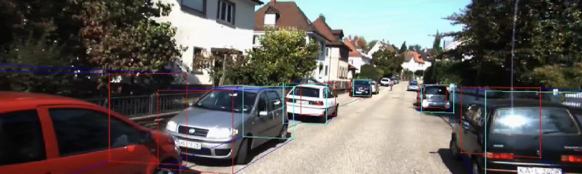
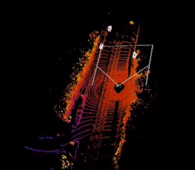
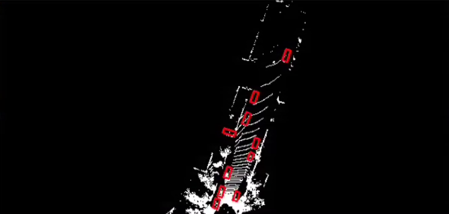

## 激光雷达点云/BEV和相机图像的3D可视化示例
### 环境配置
按照 [官方文档](https://github.com/PaddlePaddle/Paddle3D/blob/develop/docs/installation.md) 安装paddle3D依赖，然后安装`mayavi`用于激光点云可视化
```
pip install vtk==8.1.2
pip install mayavi==4.7.4
pip install PyQt5
```
### 相机图像的3D可视化示例
相机图像的3D可视化文件保存在`demo/visualization_demo/`下，提供了单帧图像的3D可视化示例程序`mono_vis_single_frame_demo.py`和多帧图像的3D可视化示例程序`mono_vis_multi_frame_demo.py`。两者使用的可视化接口相同，对应的代码在`paddle3d.apis.infer`中。

`mono_vis_single_frame_demo.py`和`mono_vis_multi_frame_demo.py`的实现方法不同，以提供更多的可视化示例方法。其中`mono_vis_single_frame_demo.py`利用paddle推理部署的方式完成可视化，`mono_vis_multi_frame_demo.py`可视化通过对图像构建`dataloader`来完成逐帧读取和推理。

`mono_vis_single_frame_demo.py`使用方式如下：
```
cd demo/visualization_demo
python mono_vis_single_frame_demo.py \
  --model_file model/smoke.pdmodel \
  --params_file model/smoke.pdiparams \
  --image data/image_2/000008.png
```
`--model_file`和`--params_file`是使用的模型参数文件对应的路径

`--image`则是输入图像的路径

`mono_vis_multi_frame_demo.py`使用方式如下：

```
python mono_vis_multi_frame_demo.py \
  --config configs/smoke/smoke_dla34_no_dcn_kitti.yml \
  --model demo/smoke.pdparams \
  --batch_size 1
```

`--config` 是模型配置文件路径

`--model` 是使用的模型参数文件对应的路径

`--batch_size` 是推理的batch数


最终的单目可视化输出如下：


### 激光雷达点云的3D可视化示例
激光雷达点云的3D可视化文件保存在`demo/visualization_demo/`下，提供了单帧激光雷达点云的3D可视化示例程序`pcd_vis_single_frame_demo.py`和多帧激光雷达点云的3D可视化示例程序`pcd_vis_multi_frame_demo.py`。两者使用的可视化接口相同，对应的代码在`paddle3d.apis.infer`中。

`pcd_vis_single_frame_demo.py`和`pcd_vis_multi_frame_demo.py`的实现方法不同，以提供更多的可视化示例方法。其中`pcd_vis_single_frame_demo.py`利用paddle推理部署的方式完成可视化，`pcd_vis_multi_frame_demo.py`可视化通过对图像构建`dataloader`来完成逐帧读取和推理。

`pcd_vis_single_frame_demo.py`使用方式如下：

```
cd demo/visualization_demo
python pcd_vis_single_frame_demo.py \
  --model_file model/pointpillars.pdmodel \
  --params_file model/pointpillars.pdiparams \
  --lidar_file data/velodyne/000008.bin \
  --calib_file data/calib/000008.txt \
  --point_cloud_range 0 -39.68 -3 69.12 39.68 1 \
  --voxel_size .16 .16 4 \
  --max_points_in_voxel 32 \
  --max_voxel_num 40000
```

`--model_file`和`--params_file` 是使用的模型参数文件对应的路径

`--lidar_file` `--calib_file` 是激光雷达点云的路径和对应的校准文件路径

`--point_cloud_range` 表示激光雷达点云的`(x,y,z)`范围区间

`--voxel_size` 表示进行voxel处理时的尺寸大小

`--max_points_in_voxel` 每个voxel中最大的激光点云数目

`--max_voxel_num` voxel的最大数目

`pcd_vis_multi_frame_demo.py`使用方式如下：

```
python pcd_vis_multi_frame_demo.py \
  --config configs/pointpillars/pointpillars_xyres16_kitti_car.yml \
  --model demo/pointpillars.pdparams \
  --batch_size 1
```

`--config` 是模型配置文件路径

`--model` 是使用的模型参数文件对应的路径

`--batch_size` 是推理的batch数

最终的激光雷达点云可视化输出如下：


### 激光雷达BEV的3D可视化示例
激光雷达BEV的3D可视化文件保存在`demo/visualization_demo/`下，提供了单帧激光雷达点云BEV的3D可视化示例程序`bev_vis_single_frame_demo.py`和多帧激光雷达点云BEV的3D可视化示例程序`bev_vis_multi_frame_demo.py`。两者使用的可视化接口相同，对应的代码在`paddle3d.apis.infer`中。

`bev_vis_single_frame_demo.py`和`bev_vis_multi_frame_demo.py`的实现方法不同，以提供更多的可视化示例方法。其中`bev_vis_single_frame_demo.py`利用paddle推理部署的方式完成可视化，`bev_vis_multi_frame_demo.py`可视化通过对图像构建`dataloader`来完成逐帧读取和推理。

`bev_vis_single_frame_demo.py`使用方式如下：

```
cd demo/visualization_demo
python bev_vis_single_frame_demo.py \
  --model_file model/pointpillars.pdmodel \
  --params_file model/pointpillars.pdiparams \
  --lidar_file data/velodyne/000008.bin \
  --calib_file data/calib/000008.txt \
  --point_cloud_range 0 -39.68 -3 69.12 39.68 1 \
  --voxel_size .16 .16 4 \
  --max_points_in_voxel 32 \
  --max_voxel_num 40000
```
`--model_file`和`--params_file` 是使用的模型参数文件对应的路径

`--lidar_file` `--calib_file` 是激光雷达点云的路径和对应的校准文件路径

`--point_cloud_range` 表示激光雷达点云的`(x,y,z)`范围区间

`--voxel_size` 表示进行voxel处理时的尺寸大小

`--max_points_in_voxel` 每个voxel中最大的激光点云数目

`--max_voxel_num` voxel的最大数目

`bev_vis_multi_frame_demo.py`使用方式如下：

```
python bev_vis_multi_frame_demo.py \
  --config configs/pointpillars/pointpillars_xyres16_kitti_car.yml \
  --model demo/pointpillars.pdparams \
  --batch_size 1
```

`--config` 是模型配置文件路径

`--model` 是使用的模型参数文件对应的路径

`--batch_size` 是推理的batch数

最终的激光雷达BEV可视化输出如下：



### 数据集和LOG文件的可视化接口
可视化接口对应的代码在`paddle3d.apis.infer`中，提供了一种调用示例

```
cd demo/visualization_demo
python dataset_vis_demo.py
```

---
如果遇到如下问题，可参考Ref1和Ref2的解决方案:

`qt.qpa.plugin: Could not load the Qt Platform plugin 'xcb' in ..`

[Ref1](https://blog.csdn.net/qq_39938666/article/details/120452028?spm=1001.2101.3001.6650.2&utm_medium=distribute.pc_relevant.none-task-blog-2%7Edefault%7ECTRLIST%7ERate-2-120452028-blog-112303826.pc_relevant_3mothn_strategy_recovery&depth_1-utm_source=distribute.pc_relevant.none-task-blog-2%7Edefault%7ECTRLIST%7ERate-2-120452028-blog-112303826.pc_relevant_3mothn_strategy_recovery&utm_relevant_index=3)
& [Ref2](https://blog.csdn.net/weixin_41794514/article/details/128578166?spm=1001.2101.3001.6650.3&utm_medium=distribute.pc_relevant.none-task-blog-2%7Edefault%7EYuanLiJiHua%7EPosition-3-128578166-blog-119480436.pc_relevant_landingrelevant&depth_1-utm_source=distribute.pc_relevant.none-task-blog-2%7Edefault%7EYuanLiJiHua%7EPosition-3-128578166-blog-119480436.pc_relevant_landingrelevant)
